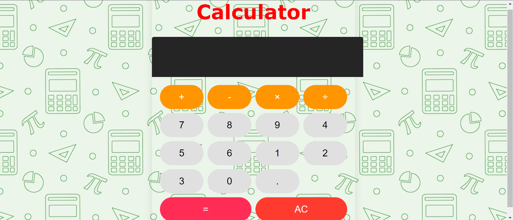

# Calculator


A calculator web application with a sleek, professional design inspired by the iPhone calculator. This project is built using HTML, CSS, and JavaScript.

## Features

- Basic arithmetic operations: addition, subtraction, multiplication, and division.
- Clear functionality to reset the calculation.
- Responsive and visually appealing UI.
- Smooth hover and active states for buttons.

## Demo

You can view the live demo of the calculator [https://prako227g.github.io/Calculator/](#).

## Screenshots



## Getting Started

Follow these instructions to get a copy of the project up and running on your local machine for development and testing purposes.

### Prerequisites

You need a web browser to open the HTML file.

### Installation

1. Clone the repository:
   ```sh
   git clone https://github.com/your-username/advanced-calculator.git
   ```
2. Navigate to the project directory:
   ```sh
   cd advanced-calculator
   ```

## Usage

Open `index.html` in your preferred web browser to use the calculator.

## Project Structure

```
advanced-calculator/
├── index.html
├── styles.css
├── scripts.js
└── img3.avif
```

- `index.html`: The main HTML file containing the structure of the calculator.
- `styles.css`: The CSS file for styling the calculator.
- `scripts.js`: The JavaScript file containing the logic for the calculator.
- `img3.avif`: The background image for the calculator.

## Customization

You can customize the look and feel of the calculator by modifying the `styles.css` file. If you want to change the background image, replace `img3.avif` with your desired image and update the CSS accordingly.

## Contributing

Contributions are welcome! Please open an issue or submit a pull request with your changes.


